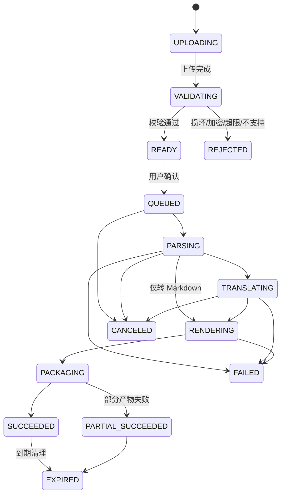
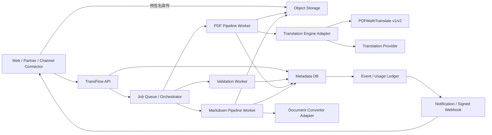

# TransFlow 多语言文档处理平台 PRD

> 本版本已被 [PRD v0.2](./PRD-v0.2.md) 取代。v0.2 根据“只抽取模型翻译能力”和“双执行模式”的新要求重新定义了产品边界。

- 版本：v0.1
- 状态：待评审
- 日期：2026-07-31
- 负责人：产品 / 待定

## 0. 一句话结论

TransFlow 不是一个“PDF 翻译网页”，而是一个**异步文档处理平台**：用户或外部平台提交文档与处理目标，平台统一完成校验、解析、翻译、转码、交付与追踪。

首版以 PDF 为输入，优先解决两件事：

1. 保留版式地生成单语译文 PDF 与双语 PDF；
2. 将 PDF 转为可继续编辑、检索和分发的 Markdown，并可生成对应译文。

所有 Web 操作复用同一套平台 Job API。未来接入闲鱼等渠道时，只新增连接器，不重写文档处理链路。

---

## 1. 背景与问题

### 1.1 用户真正要完成的任务

用户要的不是“把句子从 A 语言替换为 B 语言”，而是：

- 快速读懂一份陌生语言的完整文档；
- 保留公式、图表、目录和上下文，避免翻译后无法使用；
- 将封闭的 PDF 变为可编辑、可检索、可再次发布的内容；
- 在长任务中明确知道当前状态、预计结果和失败原因；
- 对平台方，通过稳定接口批量提交、获取结果并自动回写业务系统。

### 1.2 当前方案的断点

- 通用文本翻译丢失版式、公式、表格与阅读上下文；
- 开源工具偏工程使用，上传、任务管理、失败恢复和结果管理不完整；
- PDF 翻译与 PDF 转 Markdown 往往是两套产品，文件需要反复上传；
- 上游能力的参数、任务状态和输出格式不稳定，不适合作为对外平台合同；
- 长耗时任务若只靠前端轮询，用户离开页面后容易丢失结果；
- 外部平台需要幂等、租户隔离、限流、回调、审计等平台能力，翻译引擎本身不负责这些问题。

### 1.3 已验证的上游能力与约束

[PDFMathTranslate](https://github.com/PDFMathTranslate/PDFMathTranslate) 能保留公式、图表、目录和批注，支持多语言、多个翻译服务、页码范围、单语/双语输出，并提供 Python 与 HTTP 调用方式。其现有 HTTP API 基于 Redis/Celery，支持提交、查询进度、下载单语/双语结果和取消任务。

但需注意：

- 项目定位是科学 PDF 的保版式翻译，不是通用格式转换器；
- 2.0 已迁移到 [PDFMathTranslate-next](https://github.com/PDFMathTranslate/PDFMathTranslate-next)，并基于 BabelDOC；首版需通过压测和质量基准确定默认内核，不能只依据版本号决策；
- 两个仓库均标记为 AGPL-3.0。若修改后的程序通过网络与用户交互，许可证包含向这些用户提供相应源码的要求。具体的进程隔离、组合方式、修改范围和源码提供方式必须在上线前完成法务审查，不能把“独立服务部署”直接视为自动免责。参考 [GNU AGPL v3](https://www.gnu.org/licenses/agpl-3.0.html)。

---

## 2. 产品目标

### 2.1 产品目标

1. 用户在一个流程内完成“上传 → 配置 → 处理 → 预览 → 下载”。
2. 对合格 PDF，稳定产出可用的翻译 PDF 和/或 Markdown。
3. 将翻译、解析、转码能力封装为可替换的引擎适配器，对外只暴露稳定的平台任务协议。
4. 从第一天支持异步任务、幂等、租户、配额、回调和审计，为渠道接入打基础。
5. 建立质量、耗时、成本的可观测闭环，而不是只统计请求量。

### 2.2 北极星指标

**每周成功交付文档数**：创建任务后 24 小时内成功生成至少一个目标产物，并被用户下载、预览或由 API/Webhook 确认接收的去重文档数。

该指标同时要求“处理成功”和“结果被使用”，避免把无效上传或无人消费的产物当增长。

### 2.3 首版不追求

- 不做在线逐段 CAT 编辑器或多人校对；
- 不支持 DOCX、PPTX、XLSX、图片等输入；
- 不承诺扫描件 OCR 质量，扫描件在首版只检测并提示；
- 不做闲鱼等平台的业务页面与发布逻辑，只提供通用接入能力；
- 不训练自有翻译模型；
- 不把底层翻译供应商、线程数、模型路径等工程参数直接暴露给普通用户；
- 不在首版实现复杂计费，只记录可审计用量并支持配额。

---

## 3. 首版假设与目标用户

以下是假设，不是已验证事实。上线前需要用访谈和真实文档测试校准。

### 3.1 首发用户

| 用户 | 核心场景 | 最重要结果 |
|---|---|---|
| 知识工作者 / 学生 | 阅读外语论文、报告、说明书 | 保持原版式，快速对照阅读 |
| 内容运营 / 小团队 | 将 PDF 内容沉淀到知识库或二次编辑 | 获得结构清晰、资源完整的 Markdown |
| 开发者 / 渠道平台 | 批量提交并把结果回写业务系统 | 稳定异步 API、回调、幂等和可追踪性 |
| 平台运营人员 | 定位失败、控制成本与滥用 | 任务可检索、可重试、可审计 |

### 3.2 暂定首版边界

- 输入：数字版 PDF；单文件；建议上限 100 MB / 300 页，最终值由压测确定；
- 语言：源语言自动识别或手选；目标语言单选；首发语言集合由翻译供应商交集决定；
- 输出：单语译文 PDF、双语 PDF、源文 Markdown、译文 Markdown；
- 页面范围：全文或指定页；
- 提交端：Web；同时提供合作方可用的基础 API；
- 交付：站内预览与下载；API 支持 Webhook；
- 账户：Web 首版登录后使用，保证异步任务可找回并便于数据隔离。

---

## 4. 核心产品原则

1. **先验证再排队**：尽量在消耗计算资源前识别加密、损坏、超限、扫描型 PDF。
2. **展示阶段，不伪造精确进度**：没有可信页级数据时显示“解析中”，不能用匀速假百分比。
3. **一个输入，多种产物**：原文件只上传一次；处理产物围绕同一 Job 管理。
4. **用户选择结果，系统选择引擎**：普通用户只选择语言、页码、输出；引擎与供应商由策略路由。
5. **对外协议不泄漏上游实现**：禁止把 PDFMathTranslate 的任务 ID、Redis 状态或 CLI 参数作为公共 API。
6. **失败必须可行动**：错误信息回答“发生了什么、是否收费、用户下一步做什么”。
7. **默认私密和可删除**：文件不公开；用户可主动删除；下载链接短时有效。

---

## 5. 信息架构

### 5.1 Web 端页面

1. 登录 / 注册
2. 工作台
   - 上传区
   - 最近任务
   - 配额概览
3. 新建任务
   - 文件预检
   - 语言与页码
   - 输出格式
   - 时间 / 用量预估
4. 任务详情
   - 阶段状态
   - 原文与结果预览
   - 产物下载
   - 失败处理 / 重试 / 取消 / 删除
5. 历史任务
6. 设置
   - 数据保留
   - API Key（合作方灰度）
   - Webhook（合作方灰度）
7. 运营后台
   - 任务检索
   - 引擎健康度
   - 配额与租户
   - 人工重试 / 终止
   - 用量与成本

---

## 6. 核心交互流程

### 6.1 Web 主流程

1. 用户拖拽或选择 PDF。
2. 客户端检查后缀、MIME、文件大小，向平台申请上传地址并直传对象存储。
3. 服务端进行病毒扫描、PDF 完整性、密码、页数、文本层和源语言预检。
4. 页面展示文件信息与风险：页数、识别语言、是否疑似扫描件、可选输出、预计耗时区间和配额消耗。
5. 用户选择目标语言、页码和输出产物后提交。
6. 任务进入队列。详情页展示真实阶段；用户可以离开页面。
7. 任务完成后站内通知；合作方收到签名 Webhook。
8. 用户在详情页预览，分别下载单语 PDF、双语 PDF、Markdown ZIP 等产物。
9. 用户可删除任务及文件；系统按保留策略自动过期。

### 6.2 交互状态



规则：

- `PARTIAL_SUCCEEDED` 必须列出已成功和失败的产物，成功产物可立即下载；
- 取消采用“尽力而为”，进入不可中断的渲染阶段后可提示无法立即停止；
- 同配置重试创建新的 attempt，保留原任务审计记录；
- 用户看到的是平台状态，底层引擎状态由适配器映射。

### 6.3 关键页面要求

#### 工作台

- 首屏只有一个主要动作：“上传 PDF”；
- 明确展示支持范围、隐私与文件自动删除时间；
- 最近任务显示文件名、语言方向、当前阶段、创建时间和结果入口；
- 不让用户在上传前选择底层模型或供应商。

#### 配置页

- 默认源语言为自动识别，允许纠正；
- 默认选中“单语译文 PDF + 双语 PDF”；Markdown 为显式可选；
- 选择译文 Markdown 时，自动包含 Markdown 解析步骤，不要求用户理解流水线；
- 页码输入支持 `全部` 或如 `1-3,5,8-12`，提交前即时校验；
- 展示“预计区间”，不承诺精确完成时间；
- 疑似扫描件时阻断提交，并解释首版不支持 OCR，而不是让任务运行后失败。

#### 任务详情

- 顶部展示整体结论：处理中 / 已完成 / 部分完成 / 失败；
- 中部展示阶段时间线和已处理页数（仅在引擎提供可信进度时）；
- 完成后优先显示结果预览和下载，不再突出处理日志；
- 技术错误码可复制，用户文案必须可理解；
- 支持取消、按原配置重试、删除；
- 删除前说明将删除哪些原文件和产物且不可恢复。

---

## 7. 功能需求与验收标准

优先级：P0 为首版上线必需，P1 为首版后灰度，P2 为后续。

### 7.1 文件与预检

| ID | 优先级 | 需求 | 验收标准 |
|---|---|---|---|
| F-01 | P0 | PDF 直传对象存储 | 应用服务不转发完整文件；中断后可重新上传；跨租户不可访问 |
| F-02 | P0 | 文件真实性与安全校验 | 拒绝伪装 MIME、损坏、加密、恶意或超限文件；返回稳定错误码 |
| F-03 | P0 | 文档预检 | 返回页数、大小、源语言候选、文本层状态和扫描件风险 |
| F-04 | P0 | 重复上传去重 | 同租户同文件可复用原始 Asset；不得跨租户泄漏是否存在相同文件 |
| F-05 | P1 | 公网 URL 导入 | 仅允许安全下载；防 SSRF、重定向绕过、内网地址与超大响应 |

### 7.2 任务配置与执行

| ID | 优先级 | 需求 | 验收标准 |
|---|---|---|---|
| J-01 | P0 | 创建异步任务 | 返回平台 `job_id`；相同租户、幂等键和请求体不得重复创建任务 |
| J-02 | P0 | 语言配置 | 支持自动源语言、手动源语言、单目标语言；禁止源/目标相同 |
| J-03 | P0 | 页码范围 | 支持全文和离散范围；越界、重复、非法格式在提交前提示 |
| J-04 | P0 | 多产物选择 | 一次任务可选择 1 个或多个输出；每个产物独立记录状态 |
| J-05 | P0 | 策略路由 | 根据任务类型、语言、租户策略和引擎健康选择实现；用户 API 不感知引擎切换 |
| J-06 | P0 | 取消与重试 | 排队/运行任务可请求取消；失败任务可新建 attempt；审计链完整 |
| J-07 | P0 | 超时与死任务回收 | 超过阶段阈值自动失败或安全重试，不允许永久停留在处理中 |
| J-08 | P1 | 术语表 | 租户可维护术语对；任务引用不可变版本；结果可追溯到版本 |
| J-09 | P1 | 批量任务 | API 可提交多文件批次；单个失败不阻断其他任务 |

### 7.3 结果与历史

| ID | 优先级 | 需求 | 验收标准 |
|---|---|---|---|
| R-01 | P0 | 产物管理 | 单语 PDF、双语 PDF、Markdown 与资源 ZIP 分别有状态、大小、校验值 |
| R-02 | P0 | 安全下载 | 下载使用短时签名地址；权限在签发时校验；删除或过期后不可再签发 |
| R-03 | P0 | PDF 预览 | 原文与结果可切换；预览失败不影响下载已生成产物 |
| R-04 | P0 | Markdown 交付 | ZIP 内含 `.md` 与相对路径资源；链接在解压后可用；编码为 UTF-8 |
| R-05 | P0 | 任务历史 | 可按状态、时间、文件名筛选；默认只显示当前租户数据 |
| R-06 | P0 | 主动删除与自动过期 | 用户删除后立即失去访问权；后台异步物理清理；状态可审计 |
| R-07 | P1 | 局部重跑 | 单个失败产物可复用已有中间结果重新生成，不重复翻译成功内容 |

### 7.4 平台接入

| ID | 优先级 | 需求 | 验收标准 |
|---|---|---|---|
| A-01 | P0 | 租户 API Key | Key 只显示一次、可吊销、可设置权限和过期时间；日志不记录明文 |
| A-02 | P0 | 查询任务 | 返回平台统一状态、阶段、进度、错误和产物元数据 |
| A-03 | P0 | Webhook | 至少投递一次；HMAC 签名；事件有唯一 ID；失败指数退避重试 |
| A-04 | P0 | 外部业务标识 | 合作方可传 `external_ref` 和非敏感 metadata，便于回写关联 |
| A-05 | P0 | 限流与配额 | 按租户限制并发、请求频率、页数和存储；返回可机器处理的错误 |
| A-06 | P1 | 连接器框架 | 渠道适配器只负责鉴权、字段映射、拉取/回写，不嵌入翻译业务逻辑 |

### 7.5 运营与治理

| ID | 优先级 | 需求 | 验收标准 |
|---|---|---|---|
| O-01 | P0 | 任务检索 | 可按 job、用户、租户、外部标识、状态和时间检索 |
| O-02 | P0 | 引擎健康与熔断 | 连续错误或耗时超阈值触发降级；新任务不再路由到故障实例 |
| O-03 | P0 | 用量账本 | 记录输入页数、处理类型、引擎、供应商用量、耗时、重试和成本估算 |
| O-04 | P0 | 审计日志 | 管理员查看、重试、取消、配额修改和删除均记录操作者与原因 |
| O-05 | P1 | 质量抽检 | 支持抽样、脱敏授权、评分与问题分类；未授权用户文档不得用于训练或人工查看 |

---

## 8. Markdown 产品定义

“转成 Markdown”不是单文件文本导出，首版验收对象应为一个文档包：

```text
document.zip
├── document.md
└── assets/
    ├── image-001.png
    └── image-002.png
```

必须保留：

- 标题层级、段落、列表、代码块；
- 可识别的表格；复杂表格允许降级为图片并标注；
- 图片及其相对路径；
- 可识别的公式；无法可靠转换时保留图片并标注；
- 页面顺序；可选插入页码锚点，便于追溯原文。

需要区分两个产物：

- `source_markdown`：原语言内容的结构化 Markdown；
- `translated_markdown`：在同一结构上翻译文本后的 Markdown。

PDFMathTranslate 不承担这一定义。平台需要单独的 `DocumentConverter` 适配器；具体引擎在技术预研中通过结构还原率、资源完整率、耗时、成本和许可证共同选型。

---

## 9. 平台数据流与系统边界



### 9.1 关键架构决策

- **控制面与数据面分离**：API 只处理鉴权、元数据和调度；大文件走对象存储；
- **平台编排器拥有 Job 状态**：上游任务只是一次 engine attempt，不能成为真相来源；
- **翻译与转码分开适配**：二者可并行或串行，共享 Asset 与产物管理；
- **原始文件不可变**：每次处理引用同一 Asset 版本；产物也不可覆盖；
- **事件驱动交付**：前端可轮询/SSE，外部系统用 Webhook；事件至少投递一次，消费方必须去重；
- **中间表示逐步引入**：首版不强行改造 PDFMathTranslate；后续建立 Canonical Document IR，以复用解析结果和支撑段落级编辑。

### 9.2 为什么不直接把 PDFMathTranslate HTTP API 暴露给外部

其现有协议只覆盖提交、进度、单语/双语下载和删除，并暴露具体运行模型；平台仍需处理租户、鉴权、幂等、文件安全、多个产物、统一错误、回调、用量、保留策略和引擎替换。因此它只能位于适配器之后。

---

## 10. 核心领域模型

| 实体 | 作用 | 关键字段 |
|---|---|---|
| Tenant | 用户或合作方的隔离边界 | id, plan, quota_policy, retention_policy |
| User | Web 操作者 | id, tenant_id, role, status |
| Asset | 不可变输入文件 | id, tenant_id, object_key, sha256, mime, size, page_count, expires_at |
| Job | 用户意图与平台状态 | id, tenant_id, asset_id, operation, source_lang, target_lang, pages, status, external_ref |
| Attempt | 一次实际执行 | id, job_id, engine, engine_version, config_snapshot, status, started_at, ended_at |
| Artifact | 独立输出产物 | id, job_id, type, status, object_key, size, sha256, expires_at |
| JobEvent | 状态与审计时间线 | id, job_id, event_type, payload, occurred_at |
| UsageEntry | 配额 / 成本事实 | id, tenant_id, job_id, metric, quantity, provider_cost |
| WebhookEndpoint | 合作方回调配置 | id, tenant_id, url, secret_ref, subscribed_events, status |
| GlossaryVersion | 不可变术语表版本（P1） | id, tenant_id, language_pair, version, object_key |

约束：

- 任何业务查询必须带 `tenant_id`；
- Job 配置提交后不可原地修改，变更即新建 Job；
- Attempt 可多次，最终 Job 状态由编排器聚合；
- Artifact 独立成功或失败，支持 `PARTIAL_SUCCEEDED`；
- 外部可见 ID 使用不可枚举标识；对象存储 key 不包含用户原始文件名或敏感信息。

---

## 11. 对外 API 草案

### 11.1 原则

- REST + JSON；文件使用预签名上传/下载；
- 所有处理均异步；
- `Idempotency-Key` 用于创建类请求；
- API 版本固定在路径；
- 回调签名包含时间戳与事件 ID，防重放；
- 不暴露 engine、线程数、模型路径等内部参数；企业租户可通过策略档位选择“标准 / 高质量”，由服务端映射。

### 11.2 最小接口

```text
POST   /v1/assets/uploads             申请上传地址
POST   /v1/assets/{asset_id}/complete 确认上传并触发预检
GET    /v1/assets/{asset_id}          查询预检结果

POST   /v1/jobs                       创建处理任务
GET    /v1/jobs/{job_id}              查询任务、阶段与产物
POST   /v1/jobs/{job_id}/cancel       请求取消
POST   /v1/jobs/{job_id}/retry        基于原配置创建重试
DELETE /v1/jobs/{job_id}              删除任务与访问权

POST   /v1/artifacts/{id}/download    获取短时下载地址
GET    /v1/capabilities               获取可用语言、格式、限制和质量档位

POST   /v1/webhook-endpoints          创建回调地址
POST   /v1/webhook-endpoints/{id}/test 测试签名回调
```

### 11.3 创建任务示例

```json
{
  "asset_id": "ast_01...",
  "operation": "translate_and_convert",
  "source_language": "auto",
  "target_language": "zh-CN",
  "page_ranges": ["1-12", "15"],
  "outputs": [
    "translated_pdf",
    "bilingual_pdf",
    "source_markdown",
    "translated_markdown"
  ],
  "quality_tier": "standard",
  "external_ref": "listing_12345",
  "metadata": {
    "channel": "partner_name"
  }
}
```

### 11.4 Webhook 事件

- `job.queued`
- `job.progressed`（可订阅，默认关闭以防高频）
- `job.succeeded`
- `job.partially_succeeded`
- `job.failed`
- `job.canceled`
- `artifact.expiring`
- `job.deleted`

合作方必须按 `event_id` 去重；平台把 HTTP 2xx 视为接收成功，其他响应按指数退避重试，超过窗口进入死信并在控制台可见。

---

## 12. 错误模型

统一错误结构：

```json
{
  "error": {
    "code": "PDF_PASSWORD_PROTECTED",
    "message": "文件已加密，请移除密码后重新上传。",
    "retryable": false,
    "request_id": "req_01...",
    "details": {}
  }
}
```

错误至少分为：

- 输入不可处理：格式、损坏、加密、扫描件、超限；
- 配置非法：语言、页码、输出组合；
- 配额不足 / 并发受限；
- 上游限流 / 凭证 / 内容策略；
- 引擎解析、翻译或渲染失败；
- 平台超时、存储或队列故障；
- 用户取消；
- 产物已过期。

要求：错误码稳定；用户文案可本地化；内部堆栈不得返回；`retryable=true` 不代表自动重试一定发生，需同时返回当前动作。

---

## 13. 非功能需求

### 13.1 可靠性与性能

- 控制面月可用性目标：99.9%；
- 除文件传输外，控制面 API p95 < 500 ms；
- 任务状态更新后 10 秒内可被 Web/API 查询；
- 对“在支持范围内的数字版 PDF”，任务成功率目标 ≥ 95%，并按语言、页数、引擎版本拆分；
- 队列、翻译、渲染分别设置超时、重试上限和熔断；
- 自动重试只能用于幂等阶段；向翻译供应商重试需防止重复计费；
- 发布新引擎版本必须灰度，可按 Attempt 回溯和快速回滚。

### 13.2 安全与隐私

- TLS 传输加密；对象与敏感配置静态加密；
- 文件默认私密，禁止生成永久公开链接；
- 原文件与产物默认保留 7 天，租户可缩短；具体天数上线前确认；
- 删除操作先撤销访问，再异步物理清理对象、缓存和临时文件；
- 第三方翻译供应商及数据流向必须在用户协议/隐私说明中披露；
- 未经明确授权，用户文档不得用于模型训练或人工质量抽检；
- 运维人员默认不可查看文档内容，临时授权需有原因、时限和审计；
- 上传需病毒扫描、解压炸弹防护、PDF 解析沙箱、资源/执行时间限制；
- URL 导入上线前必须完成 SSRF 防护；
- API Key、Webhook Secret、供应商凭证进入 Secret Manager，不写数据库明文或日志；
- 明确数据驻留区域和跨境传输策略后再开放企业客户。

### 13.3 许可证与供应链

- 固定 PDFMathTranslate/BabelDOC 版本和镜像 digest，生成 SBOM；
- 保留上游许可证、版权声明和修改记录；
- 上线前由法务确认 AGPL 合规方案及对平台源代码边界的影响；
- 建立上游漏洞、版本、模型资产和翻译供应商变更监控；
- 在合规结论前，不把 PDFMathTranslate 与私有业务代码编译/链接为单体应用。

---

## 14. 指标体系

### 14.1 漏斗

1. 到达工作台
2. 开始上传
3. 预检成功
4. 确认创建任务
5. 任务成功 / 部分成功
6. 预览、下载或 API 确认接收
7. 7 日内再次处理

### 14.2 核心运营指标

- 北极星：每周成功交付文档数；
- 激活率：首次上传用户中，24 小时内获得并消费至少一个产物的比例；
- 任务成功率、产物成功率、部分成功率；
- p50/p95 排队时间、处理时间、端到端交付时间；
- 每页处理成本、供应商用量、自动重试带来的额外成本；
- 预检拒绝率及原因；
- 失败后重试率、重试成功率；
- PDF 与 Markdown 的下载/使用比例；
- 结果满意度与问题分类：漏译、错译、公式、表格、图片、排版、乱码；
- Webhook 首次成功率、最终成功率和延迟；
- 7 日留存与租户周活。

禁止只用“注册数、上传数、总页数”判断产品有效性。

---

## 15. 质量验收与测试集

上线前建立固定基准集，不用少量演示 PDF 代替质量结论。测试集需覆盖：

- 单栏、双栏、多栏；
- 纯文本、公式密集、表格密集、图表密集；
- 目录、脚注、引用、批注、链接；
- 不同字体、语言方向和字符集；
- 10、100、300 页不同规模；
- 合法但边缘的 PDF；损坏、加密、扫描型、恶意输入；
- 每个首发语言方向。

每次引擎或模型升级至少比较：

- 翻译完整率与明显错译率；
- 版式溢出、遮挡、错位、乱码页比例；
- Markdown 标题/段落/表格/图片/公式结构还原率；
- 产物可打开率和资源链接完整率；
- 成功率、端到端耗时、峰值内存与每页成本。

发布门槛由基线确定：任何 P0 语言方向和文档类型不得出现显著回退；否则只灰度到特定流量或回滚。

---

## 16. 里程碑

### M0：技术可行性与产品校准（建议 2 周）

- 建立 50–100 份基准 PDF；
- 对比 PDFMathTranslate v1、v2/BabelDOC 的质量、速度、资源和许可证集成方式；
- 选定 Markdown 转换引擎；
- 跑通 PDF → 单语/双语 PDF、PDF → Markdown、PDF → 译文 Markdown；
- 完成 AGPL 初步法务结论；
- 访谈至少三类目标用户，确认首发场景与输出优先级。

退出条件：每条流水线有可复现结果、失败边界和单位成本，不以“Demo 可运行”作为通过标准。

### M1：内部 Alpha（建议 3–4 周）

- 登录、上传、预检、配置、任务详情、下载、删除；
- 统一 Job 状态机、队列、对象存储、PDF/Markdown 适配器；
- 运营任务检索、用量账本、基础监控；
- 固定小规模内部租户和配额。

退出条件：基准集自动运行；合格 PDF 成功率达到目标；不存在跨租户访问；死任务可自动收敛。

### M2：邀请 Beta（建议 3 周）

- 历史筛选、站内通知、部分成功、重试；
- API Key、Webhook、幂等、限流；
- 真实用户灰度与质量反馈；
- 数据保留、隐私披露、许可证页面完善。

退出条件：核心漏斗可观测；Webhook 最终投递与数据删除通过演练；成本可控。

### M3：渠道接入

- 选择一个真实渠道和单一闭环场景；
- 连接器完成鉴权、字段映射、文档拉取、任务提交、结果回写；
- 渠道限流、失败补偿、人工重放与审计；
- 不在连接器复制翻译或转码逻辑。

---

## 17. 主要风险与应对

| 风险 | 根因 | 应对 |
|---|---|---|
| “支持 PDF”承诺过宽 | PDF 只是容器，内部结构差异巨大 | 首版明确数字版 PDF；预检；建立分类型基准集 |
| Markdown 与视觉 PDF 难以同时高质量 | 一个强调结构，一个强调视觉布局 | 两条独立流水线和独立质量指标，不从译文 PDF 反向解析 Markdown |
| 上游升级导致回退 | 上游版本、模型、字体资产均会变化 | 固定版本；灰度；Attempt 记录版本；回归基准 |
| 长任务体验差 | 耗时不确定、用户离开页面 | 异步任务、阶段状态、通知、历史可找回 |
| 重试造成重复成本 | 上游调用并非天然幂等 | 阶段级 checkpoint、用量账本、有限自动重试 |
| AGPL 影响私有平台边界 | 组合、修改和网络交互的法律义务 | 上线前法务结论；进程/仓库隔离只是工程措施，不替代法律判断 |
| 用户隐私或商业机密泄露 | 文档流经存储、日志、翻译供应商和运维 | 默认私密、最小保留、供应商披露、内容不入日志、访问审计 |
| 过早为闲鱼定制 | 尚未明确渠道里的具体用户任务 | 先做通用 Job API；只有确定闭环和数据契约后才做连接器 |

---

## 18. 进入 v0.2 前必须确认的决策

1. **首发核心场景**：论文/报告阅读、企业文档本地化，还是跨境电商内容处理？当前 PRD 假设前两者优先。
2. **Markdown 目标**：只要源文 Markdown，还是源文与译文都要？当前假设两者都要。
3. **首发语言集合**：需要按用户需求、供应商质量与成本共同决定，不能简单宣称“支持所有语言”。
4. **部署与数据区域**：中国大陆、海外还是双区域？这会直接改变翻译供应商、合规和架构。
5. **商业模式**：免费额度、按页、订阅或企业配额？MVP 可先记账，但必须在 Beta 前决定配额规则。
6. **质量档位**：是否向用户提供“标准 / 高质量”，以及是否允许企业 BYOK？
7. **扫描件**：是否为 Beta 引入 OCR；若扫描文档是主场景，必须提前到 P0，且产品范围和成本需要重算。
8. **AGPL 方案**：是否接受公开相应修改源码，还是寻求替代引擎/商业授权；该结论是上线阻塞项。

---

## 19. 参考资料

- [PDFMathTranslate 项目说明](https://github.com/PDFMathTranslate/PDFMathTranslate)
- [PDFMathTranslate API 文档](https://github.com/PDFMathTranslate/PDFMathTranslate/blob/main/docs/APIS.md)
- [PDFMathTranslate-next](https://github.com/PDFMathTranslate/PDFMathTranslate-next)
- [GNU Affero General Public License v3](https://www.gnu.org/licenses/agpl-3.0.html)
