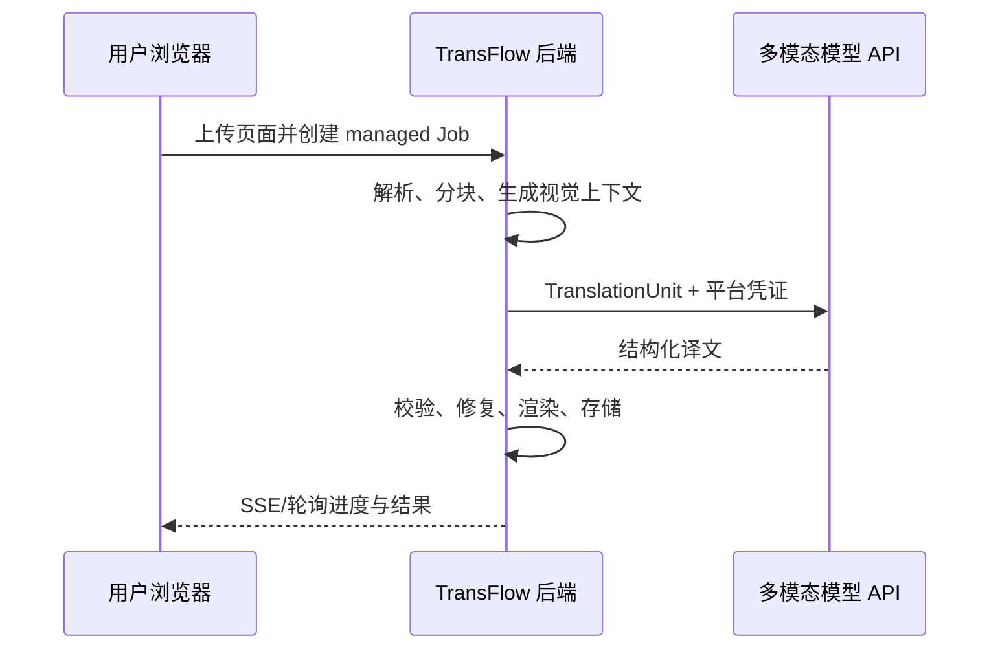
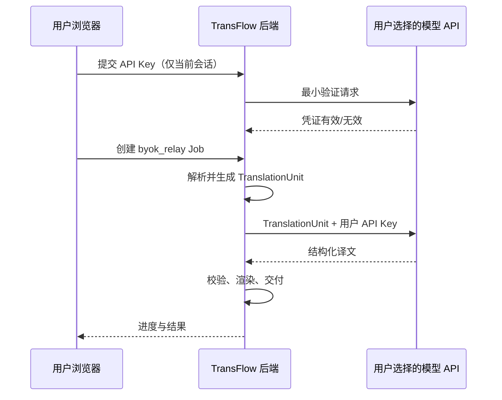

# TransFlow 多模态翻译平台 PRD

- 版本：v0.2
- 状态：待评审
- 日期：2026-07-31
- 取代版本：v0.1

## 0. 本次范围变更

TransFlow 不再把 PDFMathTranslate 的完整 PDF 处理链路作为产品核心，而只借鉴其**模型翻译层**：语言方向、提示词、公式/富文本占位符、结果缓存、重试和供应商适配。

平台重新定义自己的多模态翻译协议：

> 将页面结构化文本、公式/样式占位符和页面视觉上下文一起交给多模态模型，要求模型按稳定 Schema 返回逐段译文；页面解析、任务编排、结果校验、渲染和交付仍由 TransFlow 负责。

用户侧提供两种执行模式：

1. **平台托管模式**：平台后端持有模型凭证并完成全部模型调用；
2. **用户自带模型模式**：模型费用由用户承担，但不复用 ChatGPT 网页 Cookie 或私有接口。MVP 使用用户的官方 API Key 通过后端临时代理调用；后续可用本地 Agent 让凭证不离开用户设备。

---

## 1. 已确认的技术事实

### 1.1 上游现有实现不是多模态翻译

[PDFMathTranslate 的 `translator.py`](https://github.com/PDFMathTranslate/PDFMathTranslate/blob/main/pdf2zh/translator.py) 中：

- `BaseTranslator.translate()` 的输入是字符串；
- 默认提示词要求翻译 Markdown 文本并保留 `{v*}` 公式占位符；
- `OpenAITranslator` 调用 Chat Completions，消息内容只有文本；
- PDF 页面首先由解析/排版层拆为文本段落，翻译器逐段处理，再由上游重新排版；
- 没有向模型传入页面截图、图片、PDF 文件或视觉区域。

因此，不能把该类原样抽出后称为“多模态翻译”。TransFlow 需要保留其有效思想，但重新实现输入输出契约。

### 1.2 ChatGPT 网页登录态不能作为通用 API 凭证

OpenAI 当前公开规则是：

- ChatGPT 与 API 分开管理和计费，[ChatGPT 订阅不能直接当作 API 用量](https://help.openai.com/en/articles/8156019)；
- OpenAI API 使用 API Key 鉴权；
- [官方 API 文档](https://platform.openai.com/docs/api-reference/authentication) 明确要求 API Key 不得暴露在浏览器或客户端代码中。

当前没有面向任意第三方 Web 应用的公开机制，让应用复用 `chatgpt.com` Cookie 并以用户 ChatGPT 订阅调用模型。Codex 等产品存在特定的“使用 ChatGPT 登录”授权流程，但这不是第三方应用可自行复刻的通用协议。

因此以下方案不进入产品设计：

- 读取或上传用户的 ChatGPT Cookie；
- 模拟 ChatGPT 网页内部请求；
- 浏览器扩展注入 ChatGPT 页面并抓取私有 Token；
- 把 ChatGPT Plus/Pro 订阅额度描述为 OpenAI API 额度。

原因不是实现难，而是身份边界不成立、接口无稳定承诺、用户凭证风险高。

---

## 2. 产品目标

### 2.1 核心用户任务

用户提交一个文档页面或页面集合，指定目标语言，获得：

- 与原文结构一一对应的译文；
- 对图片、公式、表格和版面上下文更准确的翻译；
- 可预览、校对、导出或由外部平台消费的结果；
- 清楚的执行方、费用归属、进度和失败恢复方式。

### 2.2 产品目标

1. 建立与文档类型无关的多模态翻译内核；
2. 同一任务协议支持平台托管和用户自带模型两种执行方式；
3. 模型只负责翻译判断，平台掌握结构、状态、质量校验和最终产物；
4. 用户切换执行方式时，不改变文件、语言、预览和导出交互；
5. 未来接入闲鱼等渠道时，只传入页面内容并接收统一翻译结果。

### 2.3 首版非目标

- 不复用 PDFMathTranslate 的 GUI、HTTP API、Celery 任务和完整 PDF 渲染内核；
- 不支持读取 ChatGPT 网页登录态；
- 不做通用聊天；
- 不允许模型自由返回一段无法与原文对应的长文本；
- 不把 OCR、Markdown 转码或 PDF 重排定义为“翻译内核”的一部分；
- 不在首版支持多个目标语言同时翻译；
- 不保证平台页面关闭后，纯本地执行仍可继续。

---

## 3. 产品能力边界

### 3.1 平台负责

- 文件/页面接收与安全校验；
- 页面解析、文本块和视觉区域识别；
- 生成页面缩略图或裁剪图；
- 公式、富文本、链接等占位符保护；
- 分块、上下文选择与翻译任务编排；
- 模型请求 Schema、结果校验、自动修复和重试；
- 结果存储、预览、人工修改、导出与回调；
- 用量、配额、成本和质量审计。

### 3.2 模型负责

- 基于文本和视觉上下文理解语义；
- 翻译指定文本段；
- 保留段落 ID、占位符和禁止翻译内容；
- 按目标语言与术语要求输出；
- 返回结构化译文和有限的质量警告。

### 3.3 模型不负责

- 决定最终页面坐标；
- 生成或覆盖原始文件；
- 持有平台任务状态；
- 自行决定跳过哪些页面；
- 返回 HTML/脚本并直接在前端执行；
- 代替平台做权限、计费或数据保留判断。

---

## 4. 多模态翻译内核

### 4.1 翻译单元

最小处理单位不是“整份 PDF”或“任意字符串”，而是 `TranslationUnit`：

```json
{
  "unit_id": "unit_01...",
  "source_language": "en",
  "target_language": "zh-CN",
  "segments": [
    {
      "segment_id": "seg_001",
      "type": "paragraph",
      "text": "The result is shown in {{formula_1}}.",
      "do_not_translate": false
    }
  ],
  "visual_context": [
    {
      "page": 3,
      "image_ref": "temporary-signed-reference",
      "purpose": "layout_and_semantic_context"
    }
  ],
  "glossary": [
    {
      "source": "alignment",
      "target": "对齐"
    }
  ],
  "schema_version": "1.0"
}
```

模型必须返回：

```json
{
  "unit_id": "unit_01...",
  "translations": [
    {
      "segment_id": "seg_001",
      "translated_text": "结果如 {{formula_1}} 所示。"
    }
  ],
  "warnings": []
}
```

### 4.2 为什么同时传文本与图片

- 只传图片：OCR、阅读顺序和逐段回填不可控；
- 只传文本：模型看不到图表、列关系、标题层级和视觉指代；
- 文本提供精确翻译对象，图片只提供消歧上下文，两者职责清晰。

视觉上下文应按需发送，而不是每次都发送整页高清图：

- 普通连续文本：文本 + 低分辨率页图；
- 图表标题或视觉指代：文本 + 对应区域裁剪图；
- 公式：保留占位符，必要时附公式区域；
- 表格：传结构化单元格和表格区域图；
- 涉及敏感数据的租户：允许关闭视觉上下文，降级为纯文本翻译。

### 4.3 从上游保留的设计思想

- `TranslatorAdapter` 抽象；
- 语言代码映射；
- 自定义提示词；
- 公式与富文本占位符；
- 以输入、语言、模型和提示词版本组成缓存键；
- 对限流和瞬时错误重试；
- 模型响应的思维链/多余文本清理。

### 4.4 必须重新实现的部分

- 多模态消息构造；
- JSON Schema 约束；
- Segment ID 完整性校验；
- 占位符集合一致性校验；
- 缺段、重复段、错位结果修复；
- 页级上下文选择；
- 多模态用量和成本核算；
- 供应商能力协商与降级。

若直接复制 AGPL 项目代码，许可证义务必须另行确认。工程上优先定义独立协议并重新实现最小适配器，不把整个上游包作为运行时依赖。

---

## 5. 双执行模式

### 5.1 模式 A：平台托管

#### 定义

平台后端持有并管理模型供应商凭证，用户只使用 TransFlow 账户和额度。

#### 数据流



#### 用户体验

- 默认选项，文案为“平台托管”；
- 创建任务前展示平台额度或预计消耗；
- 页面可关闭，任务继续运行；
- 支持后台重试、通知、历史记录、Webhook；
- 用户不接触模型供应商配置。

#### 责任边界

- 平台承担模型成本、限流、供应商故障和凭证安全；
- 平台需向用户披露文档会发送给哪些模型供应商；
- 平台可以做统一质量路由和模型灰度。

### 5.2 模式 B：用户自带模型

#### 产品目标

用户承担模型费用，平台仍提供页面解析、任务拆分、质量校验、结果交互和导出。

模式名称不要写“使用 ChatGPT 登录”，应写“使用我的模型账户”，并明确费用来自 API 账户而不是 ChatGPT 订阅。

#### MVP 实现：BYOK 临时代理



安全要求：

- Key 默认只存在于加密会话和 Worker 内存，不写数据库、对象存储、分析系统或日志；
- 页面显示 Key 的供应商、验证状态和会话到期时间；
- 用户离开或主动断开后立即销毁；
- 任务开始前明确提示“费用由模型 API 账户收取”；
- 仅允许白名单供应商域名，禁止用户通过 `base_url` 把密钥发送到任意地址；
- 错误日志必须去除 Authorization Header；
- 若未来支持长期保存，必须进入独立 Secret Vault，并重新获得用户同意。

MVP 的代价：平台后端仍会短暂接触用户 Key。若产品承诺“平台永不接触凭证”，此方案不能使用。

#### P1 实现：本地 Agent

本地 Agent 是浏览器扩展或桌面小程序：

- Key 存储在操作系统凭证库；
- 后端把待翻译的 `TranslationUnit` 通过长连接交给 Agent；
- Agent 在用户设备上调用官方模型 API；
- Agent 将结构化译文回传后端；
- 后端不知道 Key，只接收翻译结果和最小用量信息。

限制：

- 本地 Agent 必须在线，关闭浏览器/程序后任务暂停；
- 安装成本高于 Web；
- 更新、签名、权限说明和恶意扩展防护成为新的产品成本；
- 仍需验证模型供应商是否允许对应客户端调用方式。

因此推荐先验证 BYOK 需求，再决定是否投入本地 Agent。

### 5.3 不采用的“ChatGPT 网页模式”

| 方案 | 结论 | 原因 |
|---|---|---|
| 读取 ChatGPT Cookie | 禁止 | 高风险凭证；可访问用户对话；无第三方授权边界 |
| 调用 ChatGPT 私有接口 | 禁止 | 非公开协议；随时失效；无法承诺 SLA |
| 注入 chatgpt.com 页面自动收发消息 | 不作为产品能力 | 易受页面变更、风控和账号状态影响，结果难结构化 |
| 用户手动复制到 ChatGPT 再粘回 | 可作为临时人工兜底 | 不自动化，不适合作为核心流程 |
| 独立 ChatGPT App | 后续单独验证 | 运行在 ChatGPT 内，不等同于外部 Web 页面复用登录态 |

---

## 6. 用户交互

### 6.1 新建任务

1. 上传文件或选择待翻译页面；
2. 平台完成预检并显示页数、源语言和敏感数据提示；
3. 选择目标语言；
4. 选择执行方式：
   - `平台托管（推荐）`：显示平台额度；
   - `使用我的模型账户`：连接 API 账户或本地 Agent；
5. 选择翻译范围和术语表；
6. 显示预计处理页数、费用承担方和能否离开页面；
7. 用户确认后创建任务。

### 6.2 执行方式选择卡片

| 信息 | 平台托管 | 使用我的模型账户 |
|---|---|---|
| 模型费用 | 平台额度 / 套餐 | 用户 API 账户 |
| 凭证 | 用户无需配置 | 用户连接官方 API 凭证 |
| 页面关闭后继续 | 支持 | BYOK 代理支持；本地 Agent 需保持在线 |
| 模型选择 | 平台自动路由 | 显示经过验证的兼容模型 |
| 质量保障 | 平台完整保障 | 平台保证编排；供应商额度/权限由用户负责 |
| 适合人群 | 普通用户 | 开发者、重度用户、企业用户 |

### 6.3 任务详情

统一显示以下阶段：

```text
上传 → 页面解析 → 上下文准备 → 等待模型 → 翻译 → 结果校验 → 渲染 → 完成
```

用户自带模型模式额外状态：

- 等待用户连接；
- 凭证失效；
- API 余额/配额不足；
- 本地 Agent 离线；
- 等待用户恢复。

这些状态不得归类为平台翻译失败，也不得自动切换为平台付费模式。

### 6.4 结果交互

- 页面级原文/译文对照；
- Segment 级高亮和一一对应；
- 用户可修改单段译文；
- 可对单段或单页重新翻译；
- 重试前显示由谁承担费用；
- 导出 PDF/Markdown 属于下游渲染器，不进入模型翻译内核；
- 外部平台通过 Webhook 获取 Job 与 Segment 结果。

---

## 7. 功能需求与验收

### 7.1 翻译内核

| ID | 优先级 | 需求 | 验收标准 |
|---|---|---|---|
| T-01 | P0 | 结构化输入 | 每个翻译文本都有稳定 `segment_id`；视觉上下文可选 |
| T-02 | P0 | 结构化输出 | 结果必须通过版本化 JSON Schema；禁止自由文本直接入库 |
| T-03 | P0 | 占位符保护 | 输入与输出占位符集合必须一致，否则自动修复或失败 |
| T-04 | P0 | Segment 完整性 | 不得缺少、增加或重复 Segment；顺序变化可按 ID 纠正 |
| T-05 | P0 | 多模态上下文 | 支持页图和区域裁剪图；无视觉能力的模型必须显式降级 |
| T-06 | P0 | 缓存 | 缓存键包含文本、视觉摘要、语言、术语表、模型、提示词和 Schema 版本 |
| T-07 | P0 | 重试 | 仅对瞬时错误自动重试；结构错误采用一次修复请求后失败 |
| T-08 | P0 | Provider Adapter | 平台代码不依赖单个模型供应商的请求/响应对象 |
| T-09 | P1 | 质量路由 | 低置信、图表或复杂表格可路由到更强模型或人工复核 |

### 7.2 平台托管模式

| ID | 优先级 | 需求 | 验收标准 |
|---|---|---|---|
| M-01 | P0 | 后端执行 | 浏览器关闭后任务继续；恢复登录后可查询 |
| M-02 | P0 | 用量与配额 | 创建前展示费用承担方；完成后记录页数、输入/输出用量和成本 |
| M-03 | P0 | 模型路由 | 用户无需选择具体模型；平台可灰度和回滚 |
| M-04 | P0 | 供应商故障 | 熔断后等待或安全切换；不得重复扣除用户配额 |

### 7.3 用户自带模型模式

| ID | 优先级 | 需求 | 验收标准 |
|---|---|---|---|
| B-01 | P0 | 官方 API Key | 只接受支持的供应商凭证，不接受 ChatGPT Cookie/Token |
| B-02 | P0 | 临时验证 | 创建任务前验证模型访问权限；验证请求不包含用户文档 |
| B-03 | P0 | 密钥不落库 | 自动化检查数据库、日志和错误追踪中无明文 Key |
| B-04 | P0 | 费用归属提示 | 提交与重试前明确由用户 API 账户计费 |
| B-05 | P0 | 不自动代付 | 用户额度不足时进入可恢复状态，不切换平台凭证 |
| B-06 | P0 | 主动断开 | 用户断开后会话 Key 立即销毁，未执行请求停止分发 |
| B-07 | P1 | 本地 Agent | Key 不离开设备；Agent 离线时任务暂停且可恢复 |

---

## 8. 平台接口调整

### 8.1 创建任务

```json
{
  "asset_id": "ast_01...",
  "source_language": "auto",
  "target_language": "zh-CN",
  "page_ranges": ["1-12"],
  "execution": {
    "mode": "managed"
  },
  "output": {
    "formats": ["segment_json", "bilingual_pdf"]
  }
}
```

用户自带模型：

```json
{
  "asset_id": "ast_01...",
  "source_language": "en",
  "target_language": "zh-CN",
  "page_ranges": ["1-12"],
  "execution": {
    "mode": "byok_relay",
    "credential_session_id": "cred_session_01...",
    "provider": "openai",
    "model_profile": "multimodal_standard"
  }
}
```

### 8.2 新增接口

```text
POST   /v1/credential-sessions             创建临时凭证会话
POST   /v1/credential-sessions/{id}/verify 验证凭证和模型权限
DELETE /v1/credential-sessions/{id}        断开并销毁

GET    /v1/model-capabilities              可用供应商、模型档位和限制
POST   /v1/jobs                            创建统一翻译任务
GET    /v1/jobs/{id}                       查询阶段、执行模式和费用归属
POST   /v1/jobs/{id}/resume                凭证恢复后继续
POST   /v1/segments/{id}/retranslate       重译单段
PATCH  /v1/segments/{id}                   保存人工修改
```

公共 API 不返回真实 API Key，也不返回平台内部模型凭证、完整提示词和供应商原始错误体。

---

## 9. 数据与安全边界

| 数据 | 平台托管 | BYOK 临时代理 | 本地 Agent |
|---|---|---|---|
| 原始文件/页面 | 平台可见 | 平台可见 | 平台可见 |
| TranslationUnit | 平台和模型可见 | 平台和模型可见 | 平台、Agent 和模型可见 |
| 用户 API Key | 不适用 | 后端内存短暂可见 | 仅用户设备可见 |
| 译文 | 平台可见 | 平台可见 | 回传后平台可见 |
| 供应商用量 | 平台完整记录 | 尽力记录，账单以用户供应商为准 | Agent 回传估算，账单以供应商为准 |

安全底线：

- 不存储 ChatGPT Cookie；
- 不允许前端 JavaScript 读取任意浏览器站点登录态；
- 不把用户 Key 写入 Job 配置、事件、队列 Payload 或可重放审计日志；
- 模型输入使用短时签名资源，禁止永久公开页面图片；
- 供应商返回的错误体先脱敏再记录；
- 所有人工修改保留来源：模型、用户或平台修复；
- 文档发送给第三方模型前明确告知数据流向。

---

## 10. 核心指标

### 10.1 业务指标

- 成功交付的页面数与文档数；
- 平台托管 / 用户自带模型的选择比例；
- 用户自带模型连接成功率；
- 从凭证连接到首次成功翻译的转化率；
- 用户自带模型对平台推理成本的降低额；
- 7 日内再次翻译率。

### 10.2 质量指标

- Segment 完整率；
- 占位符保持率；
- 首次 Schema 校验通过率；
- 自动修复率与修复后成功率；
- 人工修改 Segment 比例；
- 多模态相对纯文本的质量提升，按图表、公式、表格等场景拆分；
- 每页端到端耗时和模型成本。

北极星指标仍为：**被用户消费或被外部平台确认接收的成功翻译页面数**。

---

## 11. 分阶段计划

### M0：核心能力验证

- 从上游确认可借鉴的占位符、缓存和适配器行为；
- 自主实现 `TranslationUnit`、Schema 校验和多模态 OpenAI Adapter；
- 用同一批页面比较：纯文本、整页图片、文本 + 页图、文本 + 区域裁剪；
- 验证 Segment 对齐、占位符、质量、延迟和成本；
- 完成 AGPL 代码使用边界评审。

退出条件：证明视觉上下文在目标文档中产生可衡量的质量提升。若无提升，则产品不应以“多模态”为卖点。

### M1：平台托管 Alpha

- 上传、解析、任务、进度、对照预览、修改和导出；
- 平台凭证、模型路由、用量账本、失败恢复；
- 只开放一个经过验证的多模态模型档位。

### M2：BYOK Beta

- 临时凭证会话、验证、销毁和脱敏审计；
- 用户自带模型任务、余额/限流错误恢复；
- 对比实际使用率、连接流失和平台成本降低。

退出条件：用户自带模型有真实需求，且用户理解 API 与 ChatGPT 订阅的区别。

### M3：本地 Agent 决策

只有同时满足以下条件才开发：

- 大量用户拒绝让后端短暂接触 Key；
- BYOK 使用量足以覆盖安装和维护成本；
- 目标模型供应商允许对应客户端调用；
- 用户接受执行期间本地程序在线。

### M4：渠道接入

- 渠道提交页面或文档；
- TransFlow 返回统一 Segment 与 Artifact；
- 渠道不感知具体模型和凭证实现；
- 首个渠道先使用平台托管模式，稳定后再评估渠道自带模型账户。

---

## 12. 进入 v0.3 前必须确认

1. “页面”具体指 PDF 页面、网页 DOM 页面，还是两者都要？当前假设首发为 PDF 页面。
2. 用户自带模型的真实目标是“用户承担费用”，还是“平台绝不能看到凭证”？两者决定 BYOK 临时代理还是本地 Agent。
3. 是否接受放弃“ChatGPT 网页登录态”表述，改为官方 API 账户？这是当前方案成立的前提。
4. 多模态价值主要解决图表语义、复杂布局、OCR，还是图片内文字？不同目标需要不同输入和评测集。
5. 输出的首要消费方式是双语页面、Markdown、Segment JSON，还是直接回写闲鱼字段？
6. 是否接受平台托管和用户自带模式使用不同模型，导致质量、速度和结果风格存在差异？
7. 是否直接复制 AGPL 代码；若复制，许可证义务和源代码策略必须先确定。

---

## 13. 参考资料

- [PDFMathTranslate `translator.py`](https://github.com/PDFMathTranslate/PDFMathTranslate/blob/main/pdf2zh/translator.py)
- [PDFMathTranslate 项目](https://github.com/PDFMathTranslate/PDFMathTranslate)
- [OpenAI API 快速开始：API Key 与多模态输入](https://platform.openai.com/docs/quickstart)
- [OpenAI API 鉴权](https://platform.openai.com/docs/api-reference/authentication)
- [ChatGPT 与 API 分开计费](https://help.openai.com/en/articles/8156019)
- [GNU AGPL v3](https://www.gnu.org/licenses/agpl-3.0.html)
